# Preguntas relacionadas con la Ontología que cubre el ámbito del procesamiento y la recopilación de datos personales de acuerdo con lo establecido por la Ley Orgánica de Protección de Datos Personales.

A continuación, se presentan una serie de preguntas que la ontología puede responder en el ámbito de recolección y procesamiento de datos personales. Cada pregunta contendrá un identificador para facilitar su referencia, el planteamiento de la pregunta, la especificación en lenguaje SQWRL y las respuestas proporcionadas por la ontología.

## Pregunta: S001
**Planteamiento de la pregunta:**
¿Bajo qué conceptos la LOPDP no se puede aplicar?

**Consulta en lenguaje SQWRL:**  
```
Inaplicabilidad(?in) ^ explicación_de_concepto_de_inaplicabilidad(?x, ?exp) ^ es_la_no_aplicación_de_la_ley_en(?in, ?x) -> sqwrl:select(?x, ?exp)
```  
**Respuesta proporcionada por la ontología:**  
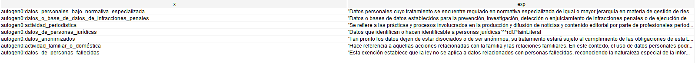  

## Pregunta: S002
**Planteamiento de la pregunta:**
¿Cuáles son los escenarios de aplicación territorial?

**Consulta en lenguaje SQWRL:**  
```
se_aplica_la_ley_en(?t, ?apt) ^ escenario_de_aplicación_territorial(?apt, ?esc) ^ Territorial(?t) -> sqwrl:select(?apt, ?esc)
```
**Respuesta proporcionada por la ontología:**  
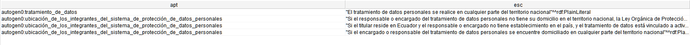  

## Pregunta: S003
**Planteamiento de la pregunta:**
¿Quiénes forman parte del sistema de protección de datos personales?


**Consulta en lenguaje SQWRL:**  
```
Integrantes_del_sistema_de_protección_de_datos_personales(?int) ^ están_compuesto_por(?int, ?p) -> sqwrl:select(?p) ^ sqwrl:limit(6)
```  
**Respuesta proporcionada por la ontología:**  
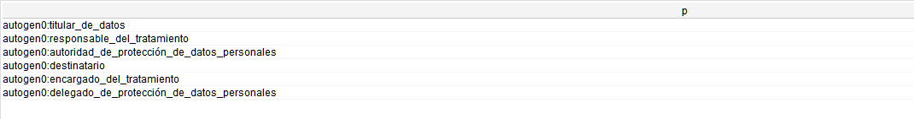  

## Pregunta: S004
**Planteamiento de la pregunta:**
¿Cómo se clasifican los tipos de datos?

**Consulta en lenguaje SQWRL:**  
```
Tipos_de_datos(?td) ^ tipos_de_datos_están_compuestos_por(?td, ?cp) ^ descripción(?cp, ?d) -> sqwrl:select(?cp, ?d)
```  
**Respuesta proporcionada por la ontología:**  
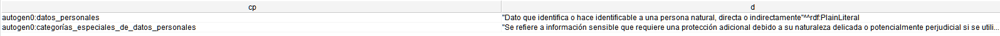  

## Pregunta: S005
**Planteamiento de la pregunta:**
¿Por quién es autorizada la entidad certificadora?

**Consulta en lenguaje SQWRL:**  
```
Entidad_certificadora(?ec) ^ es_autorizada_por(?ec, ?x) -> sqwrl:select(?x)
```  
**Respuesta proporcionada por la ontología:**  
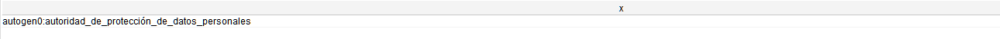  

## Pregunta: S006
**Planteamiento de la pregunta:**
¿Qué característica tienen las fuentes de acceso público?

**Consulta en lenguaje SQWRL:**  
```
Fuente_accesible_al_público(?fp) ^ tiene_la_característica_de_ser(?fp, ?tc) -> sqwrl:select(?tc)
```  
**Respuesta proporcionada por la ontología:**  
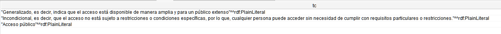  

## Pregunta: S007
**Planteamiento de la pregunta:**
¿Quién otorga los sellos de certificación?

**Consulta en lenguaje SQWRL:**  
```
Sellos_de_protección_de_datos_personales(?sc) ^ es_otorgada_por(?sc, ?x) -> sqwrl:select(?x)
```  
**Respuesta proporcionada por la ontología:**  
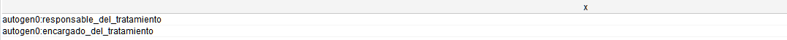  

## Pregunta: S008
**Planteamiento de la pregunta:**
¿Qué aspectos afectan la vulnerabilidad de la seguridad de los datos personales?

**Consulta en lenguaje SQWRL:**  
```
Vulnerabilidad_de_la_seguridad_de_los_datos_personales(?vs) ^ afecta_a(?vs, ?aa) -> sqwrl:select(?aa)
```  
**Respuesta proporcionada por la ontología:**  
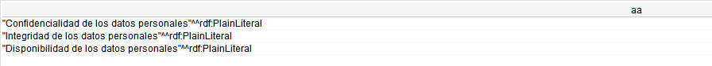  

## Pregunta: S009
**Planteamiento de la pregunta:**
¿Quién es el responsable de canalizar el ejercicio de derechos?

**Consulta en lenguaje SQWRL:**  
```
responsables_de_canalizar_el_ejercicio_de_derechos(?d, ?r) ^ Derechos(?d) ^ responsable_de_canalizar_el_ejercicio_de_derechos(?d, ?dr) -> sqwrl:select(?dr, ?r)
```  
**Respuesta proporcionada por la ontología:**  
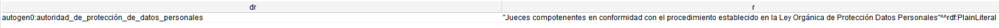 

## Pregunta: S010
**Planteamiento de la pregunta:**
¿Cuál es el significado de canalizar el ejercicio de derechos?

**Consulta en lenguaje SQWRL:**  
```
Derechos(?d) ^ descripción_responsables_de_canalizar_el_ejercicio_de_derechos(?d, ?desc) -> sqwrl:select(?desc)
```  
**Respuesta proporcionada por la ontología:**  
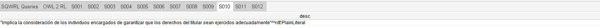  

## Pregunta: S011
**Planteamiento de la pregunta:**
¿Existen limitaciones del ejercicio de derechos según las leyes complementarias?

**Consulta en lenguaje SQWRL:**  
```
Derechos(?d) ^ limitación_de_ejercicio_de_derechos_por_leyes_secundarias(?d, ?lm) -> sqwrl:select(?lm)
```  
**Respuesta proporcionada por la ontología:**  
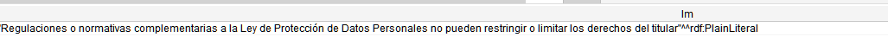  

## Pregunta: S012
**Planteamiento de la pregunta:**
¿Cuáles son las condiciones para el tratamiento legítimo de los datos?

**Consulta en lenguaje SQWRL:**  
```
Tratamiento_de_datos(?t) ^ condiciones_para_el_tratamiento_legítmo(?t, ?tl) ^ Consentimiento(?c) ^ condiciones_para_el_tratamiento_legítmo(?c, ?tl) -> sqwrl:select(?tl)
```  
**Respuesta proporcionada por la ontología:**  
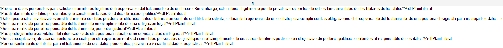  

## Pregunta: S013
**Planteamiento de la pregunta:**
¿Qué se entiende por interés legítimo?

**Consulta en lenguaje SQWRL:**  
```
Interés_legítimo(?il) ^ descripción(?il, ?ds) -> sqwrl:select(?ds)
```  
**Respuesta proporcionada por la ontología:**  
  

## Pregunta: S014
**Planteamiento de la pregunta:**
¿En qué situaciones se pueden tratar o comunicar los datos personales?

**Consulta en lenguaje SQWRL:**  
```
Consentimiento(?c) ^ para_tratar_y_comunicar_datos_personales_se_debe(?c, ?ptc) -> sqwrl:select(?ptc)
```  
**Respuesta proporcionada por la ontología:**  
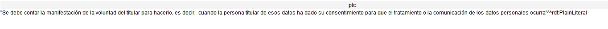

## Pregunta: S015
**Planteamiento de la pregunta:**
¿Cuáles son las condiciones para que el consentimiento sea válido?

**Consulta en lenguaje SQWRL:**  
```
Consentimiento(?c) ^ válido(?c, ?cv) -> sqwrl:select(?cv)
```  
**Respuesta proporcionada por la ontología:**  
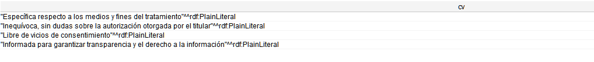

## Pregunta: S016
**Planteamiento de la pregunta:**
¿Cuál es la descripción de vicios de consentimiento?

**Consulta en lenguaje SQWRL:**  
```
Vicios_de_consentimiento(?vc) ^ descripción(?vc, ?ds) -> sqwrl:select(?ds) ^ sqwrl:limit(1)
```  
**Respuesta proporcionada por la ontología:**  
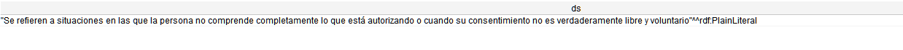

## Pregunta: S017
**Planteamiento de la pregunta:**
¿Cuándo puede un titular revocar su consentimiento?

**Consulta en lenguaje SQWRL:**  
```
Consentimiento(?c) ^ cuándo_puede_producirse(?c, ?cr) -> sqwrl:select(?cr)
```  
**Respuesta proporcionada por la ontología:**  
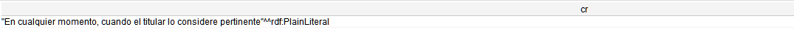

## Pregunta: S018
**Planteamiento de la pregunta:**
¿Se necesita una justificación para la revocación del consentimiento?

**Consulta en lenguaje SQWRL:**  
```
Consentimiento(?c) ^ justficación_del_revocamiento(?c, ?j) -> sqwrl:select(?j)
```  
**Respuesta proporcionada por la ontología:**  
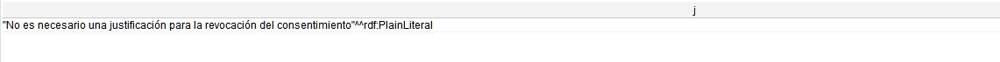

## Pregunta: S019
**Planteamiento de la pregunta:**
¿Qué deben garantizar los mecanismos de revocación del consentimiento?

**Consulta en lenguaje SQWRL:**  
```
deben_ser(?mr, ?cds) ^ Mecanismos_de_revocamiento(?mr) -> sqwrl:select(?cds)
```  
**Respuesta proporcionada por la ontología:**  
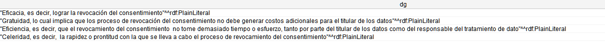

## Pregunta: S020
**Planteamiento de la pregunta:**
¿Cómo deben ser los mecanismos de revocamiento?

**Consulta en lenguaje SQWRL:**  
```
Mecanismos_de_revocamiento(?mr) ^ como_deben_ser(?mr, ?cds) -> sqwrl:select(?cds)
```  
**Respuesta proporcionada por la ontología:**  
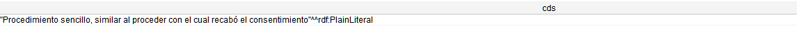

## Pregunta: S021
**Planteamiento de la pregunta:**
¿Quién establece los mecanismos de revocamiento del consentimiento?

**Consulta en lenguaje SQWRL:**  
```
son_establecidos_por(?mr, ?e) ^ Mecanismos_de_revocamiento(?mr) -> sqwrl:select(?e)
```  
**Respuesta proporcionada por la ontología:**  
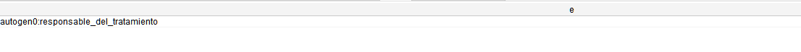

## Pregunta: S022
**Planteamiento de la pregunta:**
¿Cuál es el efecto legal de la revocación del consentimiento en relación con el tratamiento previamente realizado?

**Consulta en lenguaje SQWRL:**  
```
Revocamiento_del_consentimiento(?rc) ^ antes_de_la_revocación_del_consentimiento_se_considera(?rt, ?tarc) ^ respecto_al_tratamiento(?rc, ?rt) -> sqwrl:select(?tarc)
```  
**Respuesta proporcionada por la ontología:**  
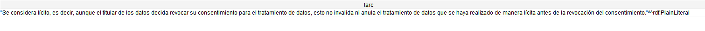

## Pregunta: S023
**Planteamiento de la pregunta:**
¿Qué acciones se deben tomar al realizar el tratamiento bajo interés legítimo?

**Consulta en lenguaje SQWRL:**  
```
bajo_interés_legítimo(?td, ?tbil) ^ Tratamiento_de_datos(?td) -> sqwrl:select(?tbil)
```  
**Respuesta proporcionada por la ontología:**  
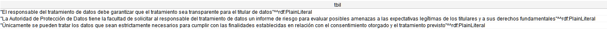

## Pregunta: S024
**Planteamiento de la pregunta:**
¿Cuáles son las características que deben tener las finalidades asociadas al tratamiento de datos personales?

**Consulta en lenguaje SQWRL:**  
```
Finalidad(?f) ^ deberán_ser(?f, ?fds) -> sqwrl:select(?fds)
```  
**Respuesta proporcionada por la ontología:**  
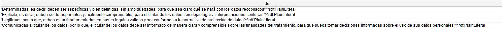

## Pregunta: S025
**Planteamiento de la pregunta:**
¿Se permite el tratamiento de datos si las finalidades para dicho tratamiento son distintas a las originalmente recogidas?

**Consulta en lenguaje SQWRL:**  
```
Finalidad(?f) ^ es_distinta_a_la_recogida_de_datos_en_el(?f, ?df) ^ para_finalidad_distinta(?df, ?tdf) -> sqwrl:select(?tdf)
```  
**Respuesta proporcionada por la ontología:**  
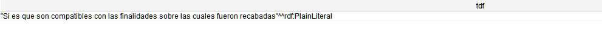

## Pregunta: S026
**Planteamiento de la pregunta:**
¿Qué consideraciones se deben tener al tratar datos para finalidades distintas a las que fueron recogidas inicialmente?

**Consulta en lenguaje SQWRL:**  
```
Finalidad(?f) ^ es_distinta_a_la_recogida_de_datos_en_el(?f, ?df) ^ determinar_la_compatibilidad(?df, ?dct) -> sqwrl:select(?dct)
```  
**Respuesta proporcionada por la ontología:**  
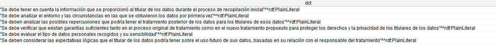

## Pregunta: S027
**Planteamiento de la pregunta:**
¿Qué criterios deben cumplir los datos personales para considerarlos bajo el principio de calidad?

**Consulta en lenguaje SQWRL:**  
```
asociada_a(?c, ?td) ^ para_cumplir_con_calidad_se_debe(?td, ?cc) ^ Calidad(?c) -> sqwrl:select(?cc)
```  
**Respuesta proporcionada por la ontología:**  
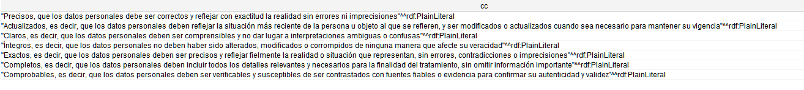

## Pregunta: S028
**Planteamiento de la pregunta:**
¿Quién es responsable de validar el principio de calidad en el tratamiento de datos?

**Consulta en lenguaje SQWRL:**  
```
Calidad(?c) ^ está_encargada_por_el(?c, ?ec) -> sqwrl:select(?ec)
```  
**Respuesta proporcionada por la ontología:**  
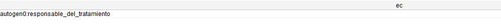

## Pregunta: S029
**Planteamiento de la pregunta:**
¿Cuándo se considera que la inexactitud de los datos no es imputable?

**Consulta en lenguaje SQWRL:**  
```
no_es_imputable_la_inexactitud_cuando(?dp, ?nii) ^ Datos_personales(?dp) -> sqwrl:select(?nii)
```  
**Respuesta proporcionada por la ontología:**  
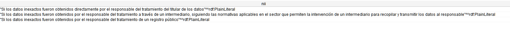

## Pregunta: S030
**Planteamiento de la pregunta:**
¿Quién determina los plazos para la suspensión o revisión periódica de los datos personales en el proceso de conservación?

**Consulta en lenguaje SQWRL:**  
```
Conservación(?c) ^ encargado_de_establecer_los_plazos_para_la_suspensión_o_revisión_periódica_dentro_del_tratamiento_de_datos_es(?c, ?cesr) -> sqwrl:select(?cesr)
```  
**Respuesta proporcionada por la ontología:**  
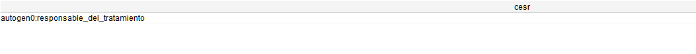

## Pregunta: S031
**Planteamiento de la pregunta:**
¿En qué situaciones se puede llevar a cabo una conservación ampliada de datos personales?

**Consulta en lenguaje SQWRL:**  
```
Conservación(?c) ^ conservación_ampliada_de_tratamiento_de_datos_personales(?c, ?catdp) -> sqwrl:select(?catdp)
```  
**Respuesta proporcionada por la ontología:**  


## Pregunta: S032
**Planteamiento de la pregunta:**
¿Qué tipos de medidas de seguridad pueden implementarse para proteger los datos personales?

**Consulta en lenguaje SQWRL:**  
```
Seguridad(?s) ^ tipos_de_medidas_de_seguridad(?s, ?tdm) -> sqwrl:select(?tdm)
```  
**Respuesta proporcionada por la ontología:**  
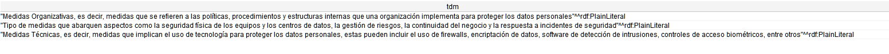

## Pregunta: S033
**Planteamiento de la pregunta:**
¿Quiénes son responsables de implementar las medidas de seguridad de los datos?

**Consulta en lenguaje SQWRL:**  
```
Seguridad(?s) ^ encargado_de_implementar_medidas_de_seguridad(?s, ?eims) -> sqwrl:select(?eims)
```  
**Respuesta proporcionada por la ontología:**  
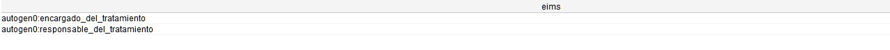

## Pregunta: S034
**Planteamiento de la pregunta:**
¿Qué actividades se deben realizar en relación con el principio de responsabilidad proactiva y demostrada por parte del responsable del tratamiento?

**Consulta en lenguaje SQWRL:**  
```
actividad_respecto_a_responsabilidad_proactiva_y_demostrada(?r, ?arpd) ^ Responsable_del_tratamiento(?r) -> sqwrl:select(?arpd)
```  
**Respuesta proporcionada por la ontología:**  
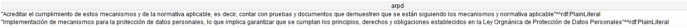

## Pregunta: S035
**Planteamiento de la pregunta:**
¿Con qué debe cumplir el responsable del tratamiento de datos en relación con la responsabilidad proactiva?

**Consulta en lenguaje SQWRL:**  
```
Responsable_del_tratamiento(?r) ^ debe_haber_cumplido_respecto_a_responsabilidad_proactiva(?r, ?dhacrrp) -> sqwrl:select(?dhacrrp)
```  
**Respuesta proporcionada por la ontología:**  
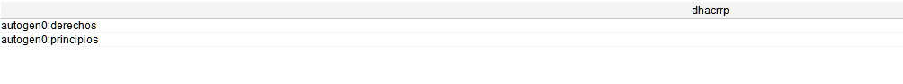

## Pregunta: S036
**Planteamiento de la pregunta:**
¿Cuáles métodos pueden emplearse para asegurar que se están cumpliendo las actividades relacionadas con el principio de responsabilidad proactiva y demostrable?

**Consulta en lenguaje SQWRL:**  
```
Responsable_del_tratamiento(?r) ^ acreditar_el_cumplimiento_de_los_mecanismos(?r, ?acm) -> sqwrl:select(?acm)
```  
**Respuesta proporcionada por la ontología:**  
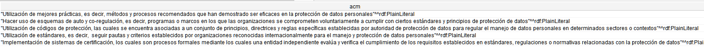

## Pregunta: S037
**Planteamiento de la pregunta:**
 ¿A quién debe rendir cuentas el responsable del tratamiento de datos en relación con el manejo de los datos?

**Consulta en lenguaje SQWRL:**  
```
debe_rendir_cuentas_respecto_al_tratamiento_con(?r, ?rcc) ^ Responsable_del_tratamiento(?r) -> sqwrl:select(?rcc)
```  
**Respuesta proporcionada por la ontología:**  
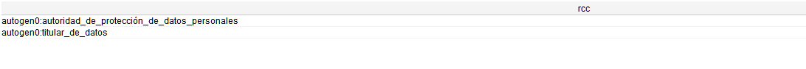

## Pregunta: S038
**Planteamiento de la pregunta:**
 ¿Quién tiene la responsabilidad de implementar el principio de independencia de control?

**Consulta en lenguaje SQWRL:**  
```
Independencia_de_control(?ic) ^ es_supervisada_por(?ic, ?ics) -> sqwrl:select(?ics)
```  
**Respuesta proporcionada por la ontología:**  
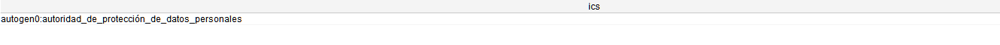

## Pregunta: S039
**Planteamiento de la pregunta:**
¿Cuáles son las acciones llevadas a cabo por la autoridad de protección de datos personales en relación con el principio de independencia de control?

**Consulta en lenguaje SQWRL:**  
```
Independencia_de_control(?ic) ^ acciones_respecto_a_la_independencia_de_control(?ics, ?aric) ^ es_supervisada_por(?ic, ?ics) -> sqwrl:select(?aric)
```  
**Respuesta proporcionada por la ontología:**  
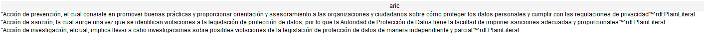

## Pregunta: S040
**Planteamiento de la pregunta:**
¿Qué tipos de datos están sujetos a regulaciones especializadas según normativas específicas?

**Consulta en lenguaje SQWRL:**  
```
Datos_en_materia_especializada(?dpme) ^ tratamiento_regulado_en_normativa_especializada_en_materia_de(?dpme, ?trne) -> sqwrl:select(?trne)
```  
**Respuesta proporcionada por la ontología:**  
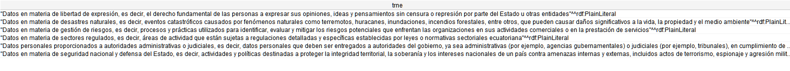

## Pregunta: S041
**Planteamiento de la pregunta:**
¿Bajo qué principios están sujetos los datos en materia especializada?

**Consulta en lenguaje SQWRL:**  
```
Datos_en_materia_especializada(?dme) ^ estarán_sujetos_a(?dme, ?es) -> sqwrl:select(?es)
```  
**Respuesta proporcionada por la ontología:**  
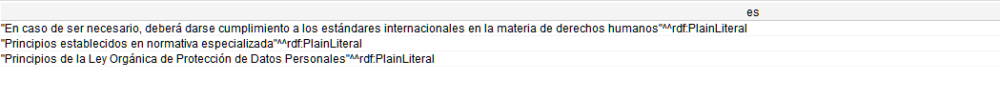

## Pregunta: S042
**Planteamiento de la pregunta:**
¿Cuáles son los criterios mínimos que los datos en materia especializadas deben cumplir?

**Consulta en lenguaje SQWRL:**  
```
Datos_en_materia_especializada(?dme) ^ deberán_cumplir_por_lo_mínimo_con(?dme, ?dcm) ^ están_conformados_por(?dcm, ?cdc) ^ descripción(?cdc, ?des) -> sqwrl:select(?cdc, ?des) ^ sqwrl:limit(3)
```  
**Respuesta proporcionada por la ontología:**  
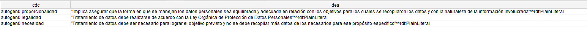

## Pregunta: S043
**Planteamiento de la pregunta:**
¿Qué debe ser comunicado en el derecho a la información?

**Consulta en lenguaje SQWRL:**  
```
Derecho_a_la_información(?di) ^ cononcer_en_el_derecho_a_la_información(?di, ?ddc) -> sqwrl:select(?ddc)
```  
**Respuesta proporcionada por la ontología:**  
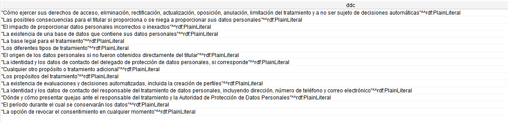

## Pregunta: S044
**Planteamiento de la pregunta:**
¿Qué debe ser comunicado en el derecho a la información?

**Consulta en lenguaje SQWRL:**  
```
en_caso_de_obtención_de_datos_directo_por_el(?c, ?codt) ^ Consentimiento(?c) ^ obtención_de_datos_personales_directamente_por_el_titular(?codt, ?odpdt) -> sqwrl:select(?odpdt)
```  
**Respuesta proporcionada por la ontología:**  
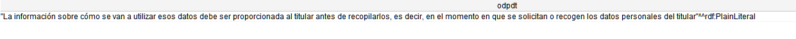

## Pregunta: S045
**Planteamiento de la pregunta:**
¿Qué procedimientos deben seguirse cuando los datos personales no se obtienen directamente del titular?

**Consulta en lenguaje SQWRL:**  
```
en_caso_de_no_obteción_directa_por_el_titular(?t, ?cnodt) ^ Consentimiento(?c) ^ en_caso_de_no_obtención_de_datos_directo_por_el(?c, ?t) -> sqwrl:select(?cnodt)
```  
**Respuesta proporcionada por la ontología:**  
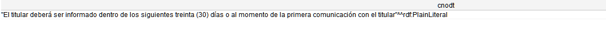

## Pregunta: S046
**Planteamiento de la pregunta:**
¿Cuál es el método adecuado para transmitir información durante el proceso de consentimiento?

**Consulta en lenguaje SQWRL:**  
```
Consentimiento(?c) ^ modo_en_que_se_podrá_transmitir_la_información_al_titular(?c, ?m) -> sqwrl:select(?m)
```  
**Respuesta proporcionada por la ontología:**  
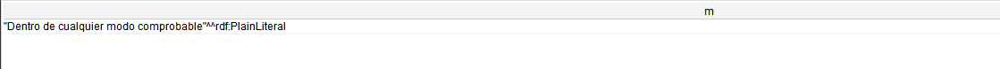

## Pregunta: S047
**Planteamiento de la pregunta:**
¿Qué características debe tener la información que se proporciona al titular de datos cuando los datos se obtienen directa o indirectamente de él?

**Consulta en lenguaje SQWRL:**  
```
Consentimiento(?c) ^ caracteristicas_que_debe_tener_la_información_transferida_al_titular(?c, ?cdti) -> sqwrl:select(?cdti)
```  
**Respuesta proporcionada por la ontología:**  
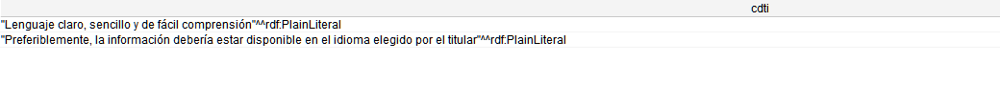

## Pregunta: S048
**Planteamiento de la pregunta:**
¿Quién es responsable de garantizar el cumplimiento del derecho de acceso?

**Consulta en lenguaje SQWRL:**  
```
Derecho_de_acceso(?da) ^ derecho_cuenta_encargado(?da, ?dce) -> sqwrl:select(?dce) ^ sqwrl:limit(1)
```  
**Respuesta proporcionada por la ontología:**  
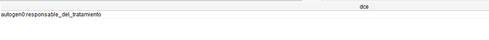

## Pregunta: S049
**Planteamiento de la pregunta:**
¿Cuáles son las actividades que el responsable del tratamiento de datos debe llevar a cabo con respecto al derecho de acceso?

**Consulta en lenguaje SQWRL:**  
```
Derecho_de_acceso(?da) ^ derecho_cuenta_encargado(?da, ?dce) ^ actividad_dentro_de_derecho_de_acceso(?dce, ?ada) -> sqwrl:select(?ada) ^ sqwrl:limit(1)
```  
**Respuesta proporcionada por la ontología:**  
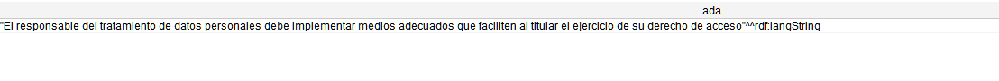

## Pregunta: S050
**Planteamiento de la pregunta:**
¿Cuál es el plazo para atender las solicitudes de acceso por parte del responsable del tratamiento?

**Consulta en lenguaje SQWRL:**  
```
Derecho_de_acceso(?da) ^ derecho_cuenta_encargado(?da, ?dce) ^ plazo_de_atención_en_días_para_el_derecho_de_acceso(?dce, ?pad) -> sqwrl:select(?pad) ^ sqwrl:limit(1)
```  
**Respuesta proporcionada por la ontología:**  
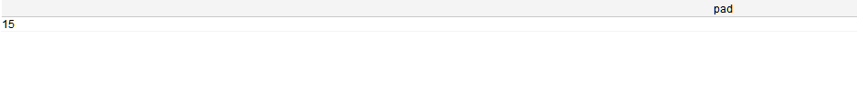

## Pregunta: S051
**Planteamiento de la pregunta:**
¿Quién es responsable de garantizar el derecho de rectificación y actualización?

**Consulta en lenguaje SQWRL:**  
```
Derecho_de_rectificación_y_actualización(?dra) ^ derecho_cuenta_encargado(?dra, ?dce) -> sqwrl:select(?dce) ^ sqwrl:limit(1)
```  
**Respuesta proporcionada por la ontología:**  
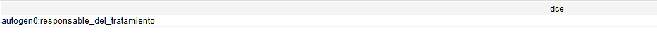

## Pregunta: S052
**Planteamiento de la pregunta:**
¿Qué actividades debe realizar el responsable del tratamiento de datos en relación con el derecho de rectificación y actualización?

**Consulta en lenguaje SQWRL:**  
```
Derecho_de_rectificación_y_actualización(?dra) ^ derecho_cuenta_encargado(?dra, ?dce) ^ actividad_dentro_de_derecho_de_rectificación_y_actualización(?dce, ?adra) -> sqwrl:select(?adra) ^ sqwrl:limit(1)
```  
**Respuesta proporcionada por la ontología:**  
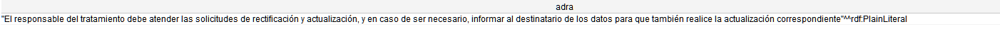

## Pregunta: S053
**Planteamiento de la pregunta:**
¿Cuál es el plazo para atender las solicitudes de rectificación y actualización?

**Consulta en lenguaje SQWRL:**  
```
Derecho_de_rectificación_y_actualización(?dra) ^ derecho_cuenta_encargado(?dra, ?dce) ^ plazo_de_atención_en_días_para_el_derecho_de_rectificación_y_actualización(?dce, ?p) -> sqwrl:select(?p) ^ sqwrl:limit(1)
```  
**Respuesta proporcionada por la ontología:**  


## Pregunta: S054
**Planteamiento de la pregunta:**
¿Quién es el responsable de garantizar el derecho de eliminación?

**Consulta en lenguaje SQWRL:**  
```
Derecho_de_eliminación(?de) ^ derecho_cuenta_encargado(?de, ?dce) -> sqwrl:select(?dce) ^ sqwrl:limit(1)
```  
**Respuesta proporcionada por la ontología:**  


## Pregunta: S055
**Planteamiento de la pregunta:**
¿En qué circunstancias se pueden eliminar los datos personales?

**Consulta en lenguaje SQWRL:**  
```
Derecho_de_eliminación(?de) ^ cuándo_se_puede_eliminar_los_datos_personales(?dce, ?cedp) -> sqwrl:select(?cedp) ^ sqwrl:limit(7)
```  
**Respuesta proporcionada por la ontología:**  


## Pregunta: S056
**Planteamiento de la pregunta:**
¿Qué actividades lleva a cabo el responsable del tratamiento de datos dentro del derecho de eliminación?

**Consulta en lenguaje SQWRL:**  
```
Derecho_de_eliminación(?de) ^ derecho_cuenta_encargado(?de, ?dce) ^ actividad_dentro_de_derecho_de_eliminación(?dce, ?ade) -> sqwrl:select(?ade) ^ sqwrl:limit(1)
```  
**Respuesta proporcionada por la ontología:**  


## Pregunta: S057
**Planteamiento de la pregunta:**
 ¿Cuál es el plazo de atención para las solicitudes de eliminación de datos?

**Consulta en lenguaje SQWRL:**  
```
Derecho_de_eliminación(?de) ^ derecho_cuenta_encargado(?de, ?dce) ^ plazo_de_atención_en_días_para_el_derecho_de_eliminación(?dce, ?pde) -> sqwrl:select(?pde) ^ sqwrl:limit(1)
```  
**Respuesta proporcionada por la ontología:**  


## Pregunta: S058
**Planteamiento de la pregunta:**
¿Quién es responsable de garantizar el derecho de oposición?

**Consulta en lenguaje SQWRL:**  
```
Derecho_de_oposición(?do) ^ derecho_cuenta_encargado(?do, ?dce) -> sqwrl:select(?dce) ^ sqwrl:limit(1)
```  
**Respuesta proporcionada por la ontología:**  


## Pregunta: S059
**Planteamiento de la pregunta:**
¿En qué situaciones puede oponerse el titular al tratamiento de datos?

**Consulta en lenguaje SQWRL:**  
```
cuándo_se_puede_oponer_al_tratamiento(?do, ?cpot) ^ Derecho_de_oposición(?do) -> sqwrl:select(?cpot)
```  
**Respuesta proporcionada por la ontología:**  


## Pregunta: S060
**Planteamiento de la pregunta:**
¿Qué sucede con el tratamiento de datos en caso de mercadotecnia directa?

**Consulta en lenguaje SQWRL:**  
```
Derecho_de_oposición(?do) ^ en_caso_de_mercadotécnia_directa(?do, ?md) -> sqwrl:select(?md)
```  
**Respuesta proporcionada por la ontología:**  


## Pregunta: S061
**Planteamiento de la pregunta:**
¿Qué actividades debe llevar a cabo el responsable del tratamiento de datos en relación con el derecho de oposición?

**Consulta en lenguaje SQWRL:**  
```
Derecho_de_oposición(?do) ^ derecho_cuenta_encargado(?do, ?dce) ^ actividad_dentro_de_derecho_de_oposición(?dce, ?ado) -> sqwrl:select(?ado) ^ sqwrl:limit(1)
```  
**Respuesta proporcionada por la ontología:**  


## Pregunta: S062
**Planteamiento de la pregunta:**
¿Cuántos días tiene el responsable del tratamiento de datos para atender las solicitudes de oposición?

**Consulta en lenguaje SQWRL:**  
```
Derecho_de_oposición(?do) ^ derecho_cuenta_encargado(?do, ?dce) ^ plazo_de_atención_en_días_para_el_derecho_de_oposición(?dce, ?pado) -> sqwrl:select(?pado) ^ sqwrl:limit(1)
```  
**Respuesta proporcionada por la ontología:**  


## Pregunta: S063
**Planteamiento de la pregunta:**
¿Cuáles son las excepciones a los derechos de rectificación, actualización, eliminación y oposición?

**Consulta en lenguaje SQWRL:**  
```
Excepciones_de_derechos(?ed) ^ derechos_para_rectificación_actualización_eliminación_y_oposición(?ed, ?edc) -> sqwrl:select(?edc)
```  
**Respuesta proporcionada por la ontología:**  


## Pregunta: S064
**Planteamiento de la pregunta:**
¿Cuáles son las condiciones para suspender el tratamiento de datos?

**Consulta en lenguaje SQWRL:**  
```
Derecho_a_la_suspensión_del_tratamiento(?dst) ^ condiciones_para_la_suspensión_del_tratamiento(?dst, ?cst) -> sqwrl:select(?cst)
```  
**Respuesta proporcionada por la ontología:**  


## Pregunta: S064
**Planteamiento de la pregunta:**
¿Cuáles son las condiciones para suspender el tratamiento de datos?

**Consulta en lenguaje SQWRL:**  
```
Derecho_a_la_suspensión_del_tratamiento(?dst) ^ condiciones_para_la_suspensión_del_tratamiento(?dst, ?cst) -> sqwrl:select(?cst)
```  
**Respuesta proporcionada por la ontología:**  


## Pregunta: S065
**Planteamiento de la pregunta:**
¿Dónde debe dirigirse el titular de los datos si experimenta problemas relacionados con la suspensión del tratamiento de datos?

**Consulta en lenguaje SQWRL:**  
```
Titular(?t) ^ en_caso_de_suspesión_de_tratamiento_debe_recurrir_hacia(?t, ?st) -> sqwrl:select(?st)
```  
**Respuesta proporcionada por la ontología:**  


## Pregunta: S066
**Planteamiento de la pregunta:**
¿Cuándo debe recurrir el titular de los datos a la autoridad de protección de datos personales respecto a la suspensión del tratamiento?

**Consulta en lenguaje SQWRL:**  
```
Derecho_a_la_suspensión_del_tratamiento(?dst) ^ cuando_debe_ocurrir_el_titular_a_la_autoridad_de_protección_de_datos_personales(?dst, ?drapd) -> sqwrl:select(?drapd)
```  
**Respuesta proporcionada por la ontología:**  


## Pregunta: S067
**Planteamiento de la pregunta:**
¿Cómo debe actuar el responsable del tratamiento ante la impugnación de la exactitud de los datos por parte del titular?

**Consulta en lenguaje SQWRL:**  
```
Titular(?t) ^ en_caso_de_impugar_la_exactitud_de_los_datos_a(?t, ?tcidp) ^ ante_impugnación_de_exactitud_de_datos(?tcidp, ?idp) -> sqwrl:select(?idp)
```  
**Respuesta proporcionada por la ontología:**  


## Pregunta: S068
**Planteamiento de la pregunta:**
¿Bajo qué circunstancias pueden tratarse los datos personales impugnados en el derecho a la suspensión?

**Consulta en lenguaje SQWRL:**  
```
Derecho_a_la_suspensión_del_tratamiento(?dst) ^ supuestos_para_tratar_los_datos_en_caso_de_impugnación_de_los_mismos(?dst, ?stdcidp) -> sqwrl:select(?stdcidp)
```  
**Respuesta proporcionada por la ontología:**  


## Pregunta: S069
**Planteamiento de la pregunta:**
¿Qué actividades puede realizar el titular de los datos en caso de valoraciones automatizadas?

**Consulta en lenguaje SQWRL:**  
```
en_caso_de_valoraciones_automatizadas(?t, ?cda) ^ Derecho_a_no_ser_objeto_de_valoraciones_automatizadas(?dnva) ^ para_el(?dnva, ?t) -> sqwrl:select(?cda)
```  
**Respuesta proporcionada por la ontología:**  


## Pregunta: S070
**Planteamiento de la pregunta:**
¿En qué escenarios no se aplica el derecho a no ser objeto de decisiones basadas en valoraciones automatizadas?

**Consulta en lenguaje SQWRL:**  
```
derechos_para_no_ser_objeto_de_valoraciones_automatizadas(?ed, ?edva) ^ Excepciones_de_derechos(?ed) -> sqwrl:select(?edva)
```  
**Respuesta proporcionada por la ontología:**  


## Pregunta: S071
**Planteamiento de la pregunta:**
¿Es posible revocar el derecho a no ser sujeto de decisiones automatizadas a través de contratos previos?

**Consulta en lenguaje SQWRL:**  
```
Excepciones_de_derechos(?ed) ^ no_se_podrá_revocar_el_derecho_a_no_ser_objeto_de_valoraciones_automatizadas(?ed, ?rdova) -> sqwrl:select(?rdova)
```  
**Respuesta proporcionada por la ontología:**  


## Pregunta: S072
**Planteamiento de la pregunta:**
¿Qué tipo de datos no pueden ser tratados bajo el derecho a no ser objeto de valoraciones automatizadas y en qué condiciones sí?

**Consulta en lenguaje SQWRL:**  
```
no_se_podrán_tratar(?dova, ?ntd) ^ Derecho_a_no_ser_objeto_de_valoraciones_automatizadas(?dova) ^ datos_no_sujetos_a_tratamiento_según_el_derecho_a_no_ser_objeto_de_decisiones_automatizadas(?ntd, ?dnst) -> sqwrl:select(?dnst)
```  
**Respuesta proporcionada por la ontología:**  


## Pregunta: S073
**Planteamiento de la pregunta:**
¿En qué circunstancias el tratamiento de datos puede estar sujeto a decisiones automatizadas conforme al derecho de no ser objeto de tales decisiones automatizadas?

**Consulta en lenguaje SQWRL:**  
```
no_se_podrán_tratar(?dova, ?ntd) ^ Derecho_a_no_ser_objeto_de_valoraciones_automatizadas(?dova) ^ datos_sujetos_a_tratamiento_según_el_derecho_a_no_ser_objeto_de_decisiones_automatizadas(?ntd, ?dst) -> sqwrl:select(?dst)
```  
**Respuesta proporcionada por la ontología:**  


## Pregunta: S074
**Planteamiento de la pregunta:**
¿A partir de qué edad puede dar el titular su consentimiento explícito para el tratamiento de datos personales?

**Consulta en lenguaje SQWRL:**  
```
Titular(?t) ^ puede_dar_consentimiento_explícito_para_el_tratamiento(?t, true) -> sqwrl:select(?t)
```  
**Respuesta proporcionada por la ontología:**  


## Pregunta: S075
**Planteamiento de la pregunta:**
¿Qué características debe tener la consulta en el marco del derecho a la consulta?

**Consulta en lenguaje SQWRL:**  
```
Derecho_de_consulta(?dc) ^ garatiza_que(?dc, ?gq) -> sqwrl:select(?gq)
```  
**Respuesta proporcionada por la ontología:**  


## Pregunta: S076
**Planteamiento de la pregunta:**
¿En qué entidad se pueden consultar los datos personales según lo establecido en el derecho de consulta?

**Consulta en lenguaje SQWRL:**  
```
Derecho_de_consulta(?dc) ^ dónde_puede_consultar(?dc, ?dpc) -> sqwrl:select(?dpc)
```  
**Respuesta proporcionada por la ontología:**  


## Pregunta: S077
**Planteamiento de la pregunta:**
¿Cuál es el concepto central asociado al ámbito del derecho de la educación digital en la LOPDP?

**Consulta en lenguaje SQWRL:**  
```
Derecho_a_la_educación_digital(?ded) ^ derecho_al_acceso_y_disponibilidad(?ded, ?sdad) -> sqwrl:select(?sdad)
```  
**Respuesta proporcionada por la ontología:**  


## Pregunta: S078
**Planteamiento de la pregunta:**
 ¿Quiénes son responsables de garantizar el derecho a la educación digital?

**Consulta en lenguaje SQWRL:**  
```
Derecho_a_la_educación_digital(?ded) ^ garantizar_la_educación_digital(?ded, ?dged) -> sqwrl:select(?dged)
```  
**Respuesta proporcionada por la ontología:**  


## Pregunta: S079
**Planteamiento de la pregunta:**
¿Sobre qué personas recae el carácter inclusivo de la educación digital?

**Consulta en lenguaje SQWRL:**  
```
Derecho_a_la_educación_digital(?ded) ^ carácter_inclusivo_en(?ded, ?cied) -> sqwrl:select(?cied)
```  
**Respuesta proporcionada por la ontología:**  


## Pregunta: S080
**Planteamiento de la pregunta:**
¿En qué consiste el ejercicio de derechos?

**Consulta en lenguaje SQWRL:**  
```
Ejercicio_de_derechos(?ed) ^ descripción(?ed, ?d) -> sqwrl:select(?d)
```  
**Respuesta proporcionada por la ontología:**  


## Pregunta: S081
**Planteamiento de la pregunta:**
¿Quiénes deben proporcionar capacitación e información sobre el uso y tratamiento responsable de datos?

**Consulta en lenguaje SQWRL:**  
```
Ejercicio_de_derechos(?ed) ^ deben_dar_capacitación_y_proveer_información(?ed, ?ddc) -> sqwrl:select(?ddc)
```  
**Respuesta proporcionada por la ontología:**  


## Pregunta: S082
**Planteamiento de la pregunta:**
¿Cuáles son las categorías especiales de datos personales?

**Consulta en lenguaje SQWRL:**  
```
Categorías_especiales_de_datos_personales(?cde) ^ categorías_especiales_de_datos_personales_están_compuestos_por(?cde, ?ecp) -> sqwrl:select(?ecp) ^ sqwrl:limit(4)
```  
**Respuesta proporcionada por la ontología:**  


## Pregunta: S083
**Planteamiento de la pregunta:**
¿Bajo qué circunstancias se puede realizar el procesamiento de datos sensibles, incluso cuando no es válido el tratamiento de datos sensibles?

**Consulta en lenguaje SQWRL:**  
```
Tratamiento_de_datos_sensibles(?tds) ^ escenarios_de_tratamiento_de_datos_sensibles(?tds, ?etds) -> sqwrl:select(?etds)
```  
**Respuesta proporcionada por la ontología:**  


## Pregunta: S084
**Planteamiento de la pregunta:**
¿Quién tiene la autoridad para otorgar el consentimiento para el procesamiento de datos personales de una persona fallecida?

**Consulta en lenguaje SQWRL:**  
```
cuenta_con_un(?tf, ?cu) ^ Titular_fallecido(?tf) -> sqwrl:select(?cu)
```  
**Respuesta proporcionada por la ontología:**  


## Pregunta: S085
**Planteamiento de la pregunta:**
¿Qué acciones pueden realizar los titulares de derechos sucesores en relación con el ejercicio de los derechos de una persona fallecida a la que representan?

**Consulta en lenguaje SQWRL:**  
```
cuenta_con_un(?tf, ?cu) ^ ejercicio_de_derechos_por_parte_del_titular_fallecido(?cu, ?ed) ^ Titular_fallecido(?tf) -> sqwrl:select(?ed)
```  
**Respuesta proporcionada por la ontología:**  


## Pregunta: S086
**Planteamiento de la pregunta:**
¿Qué aspectos permiten evaluar el tratamiento de datos crediticios?

**Consulta en lenguaje SQWRL:**  
```
Tratamiento_de_datos_crediticios(?tdc) ^ permitan_evaluar(?tdc, ?pe) -> sqwrl:select(?pe)
```  
**Respuesta proporcionada por la ontología:**  


## Pregunta: S087
**Planteamiento de la pregunta:**
¿Qué información puede proporcionar el tratamiento de datos crediticios?

**Consulta en lenguaje SQWRL:**  
```
para_informar_sobre(?tdc, ?pis) ^ Tratamiento_de_datos_crediticios(?tdc) -> sqwrl:select(?pis)
```  
**Respuesta proporcionada por la ontología:**  


## Pregunta: S088
**Planteamiento de la pregunta:**
¿Cuáles son las fuentes de las que pueden obtenerse los datos crediticios?

**Consulta en lenguaje SQWRL:**  
```
Tratamiento_de_datos_crediticios(?tdc) ^ fuentes_de_dónde_se_obtuvieron_los_datos_crediticios(?tdc, ?fdo) -> sqwrl:select(?fdo)
```  
**Respuesta proporcionada por la ontología:**  


## Pregunta: S089
**Planteamiento de la pregunta:**
¿Con qué finalidad se puede llevar a cabo el tratamiento de datos crediticios?

**Consulta en lenguaje SQWRL:**  
```
Tratamiento_de_datos_crediticios(?tdc) ^ destinado(?tdc, ?tddc) -> sqwrl:select(?tddc)
```  
**Respuesta proporcionada por la ontología:**  


## Pregunta: S090
**Planteamiento de la pregunta:**
¿Qué acciones están restringidas en relación con el tratamiento de datos crediticios?

**Consulta en lenguaje SQWRL:**  
```
Tratamiento_de_datos_crediticios(?tdc) ^ no_se_podrá_hacer_con_el_tratamiento_de_datos_crediticios(?tdc, ?npad) -> sqwrl:select(?npad)
```  
**Respuesta proporcionada por la ontología:**  


## Pregunta: S091
**Planteamiento de la pregunta:**
¿Cuáles son los derechos de los titulares de datos crediticios?

**Consulta en lenguaje SQWRL:**  
```
Derecho_de_los_titulares_de_datos_crediticios(?dtdc) ^ derechos_de_los_titulares_de_datos_crediticios(?dtdc, ?dtd) -> sqwrl:select(?dtd)
```  
**Respuesta proporcionada por la ontología:**  


## Pregunta: S092
**Planteamiento de la pregunta:**
¿Cuáles son las condiciones para garantizar el derecho de acceso para los titulares de datos crediticios?

**Consulta en lenguaje SQWRL:**  
```
Derecho_de_los_titulares_de_datos_crediticios(?dtdc) ^ derecho_al_acceso_de_los_titulares_de_datos_crediticios(?dtdc, ?dadp) -> sqwrl:select(?dadp)
```  
**Respuesta proporcionada por la ontología:**  


## Pregunta: S093
**Planteamiento de la pregunta:**
¿Cuáles son los mecanismos para asegurar el derecho de acceso a los datos personales de los titulares de datos crediticios?

**Consulta en lenguaje SQWRL:**  
```
Derecho_de_los_titulares_de_datos_crediticios(?dtdc) ^ mecanismos_para_asegurar_el_derecho_de_acceso_del_titular_de_datos_crediticios(?dtdc, ?mada) -> sqwrl:select(?mada)
```  
**Respuesta proporcionada por la ontología:**  


## Pregunta: S094
**Planteamiento de la pregunta:**
¿Qué acciones debe realizar el titular de datos crediticios con respecto al derecho de actualización, rectificación o eliminación de datos crediticios?

**Consulta en lenguaje SQWRL:**  
```
Derecho_de_los_titulares_de_datos_crediticios(?dtdc) ^ derecho_de_actualización_rectificación_o_eliminación_del_titular_de_datos_crediticios(?dtdc, ?daredc) -> sqwrl:select(?daredc)
```  
**Respuesta proporcionada por la ontología:**  


## Pregunta: S095
**Planteamiento de la pregunta:**
¿Qué debe hacer la fuente de información respecto a la solicitud de actualización, rectificación o eliminación realizada por el titular de datos crediticios?

**Consulta en lenguaje SQWRL:**  
```
Derecho_de_los_titulares_de_datos_crediticios(?dtdc) ^ fuente_de_información_actividad_frente_la_solicitud(?dtdc, ?afi) -> sqwrl:select(?afi)
```  
**Respuesta proporcionada por la ontología:**  


## Pregunta: S096
**Planteamiento de la pregunta:**
¿Quiénes son responsables de tratar los datos personales relativos a la salud?

**Consulta en lenguaje SQWRL:**  
```
Tratamiento_de_datos_relativos_a_salud(?tds) ^ recolección_y_tratamiento_de_dato_relativo_a_salud(?tds, ?rtdrs) -> sqwrl:select(?rtdrs)
```  
**Respuesta proporcionada por la ontología:**  


## Pregunta: S097
**Planteamiento de la pregunta:**
¿Es necesario el consentimiento del titular para el tratamiento de sus datos relativos a salud?

**Consulta en lenguaje SQWRL:**  
```
Tratamiento_de_datos_relativos_a_salud(?tds) ^ en_lo_que_respecta_a_el(?tds, ?ctds) ^ para_datos_relativos_a_salud_sin_consentimiento(?ctds, ?cdrs) -> sqwrl:select(?cdrs)
```  
**Respuesta proporcionada por la ontología:**  


## Pregunta: S098
**Planteamiento de la pregunta:**
¿En qué situaciones se puede realizar el tratamiento de datos sin la necesidad del consentimiento del titular?

**Consulta en lenguaje SQWRL:**  
```
Tratamiento_de_datos_relativos_a_salud(?tds) ^ escenarios_de_aplicación_para_el_tratamiento_de_datos_sin_consentimiento(?tds, ?eatds) -> sqwrl:select(?eatds)
```  
**Respuesta proporcionada por la ontología:**  


## Pregunta: S099
**Planteamiento de la pregunta:**
¿Quién debe supervisar el tratamiento de datos cuando las actividades que involucran datos relativos a la salud están relacionadas con la gestión de los servicios de salud?

**Consulta en lenguaje SQWRL:**  
```
Tratamiento_de_datos_relativos_a_salud(?tds) ^ supervisar_el_tratamiento_en_actividades_de_gestión_de_servicio_de_salud(?tds, ?dst) -> sqwrl:select(?dst)
```  
**Respuesta proporcionada por la ontología:**  


## Pregunta: S100
**Planteamiento de la pregunta:**
¿Quién es el responsable de otorgar la autorización para el tratamiento de datos relativos a la salud?

**Consulta en lenguaje SQWRL:**  
```
Tratamiento_de_datos_relativos_a_salud(?tds) ^ deberá_ser_autorizado_por(?tds, ?tdrsdsa) -> sqwrl:select(?tdrsdsa)
```  
**Respuesta proporcionada por la ontología:**  


## Pregunta: S101
**Planteamiento de la pregunta:**
¿En qué circunstancias debe la autoridad de protección de datos personales autorizar el tratamiento de datos de salud?

**Consulta en lenguaje SQWRL:**  
```
Tratamiento_de_datos_relativos_a_salud(?tds) ^ deberá_ser_autorizado_por(?tds, ?tdrsdsa) ^ acciones_respecto_al_tratamiento_de_datos_de_salud(?tdrsdsa, ?artds) -> sqwrl:select(?artds)
```  
**Respuesta proporcionada por la ontología:**  


## Pregunta: S102
**Planteamiento de la pregunta:**
¿Qué requisitos deben cumplirse para obtener la autorización para el tratamiento de datos relativos a salud por parte de la Autoridad de Protección de Datos Personales?

**Consulta en lenguaje SQWRL:**  
```
autorización_de_tratamiento_de_datos_de_salud_anonimizados(?tds, ?atds) ^ Tratamiento_de_datos_relativos_a_salud(?tds) -> sqwrl:select(?atds)
```  
**Respuesta proporcionada por la ontología:**  


## Pregunta: S103
**Planteamiento de la pregunta:**
¿Con qué fines pueden ser tratados los datos relativos a la salud dentro del Sistema Nacional de Salud por entidades públicas y privadas?

**Consulta en lenguaje SQWRL:**  
```
Tratamiento_de_datos_relativos_a_salud(?tds) ^ fines_del_tratamiento_de_datos_por_entes_privados_y_públicos(?tds, ?tdepp) -> sqwrl:select(?tdepp)
```  
**Respuesta proporcionada por la ontología:**  


## Pregunta: S104
**Planteamiento de la pregunta:**
¿Bajo qué condiciones pueden los entes públicos y privados llevar a cabo el tratamiento de datos relacionados con la salud?

**Consulta en lenguaje SQWRL:**  
```
Tratamiento_de_datos_relativos_a_salud(?tds) ^ escenarios_para_el_tratamiento_por_entes_privados_y_públicos(?tds, ?eptepp) -> sqwrl:select(?eptepp)
```  
**Respuesta proporcionada por la ontología:**  


## Pregunta: S105
**Planteamiento de la pregunta:**
¿Cuáles son las obligaciones del responsable y encargado del tratamiento de datos?

**Consulta en lenguaje SQWRL:**  
```
Responsable_del_tratamiento(?rt) ^ obligaciones(?rt, ?o) -> sqwrl:select(?o) ^ sqwrl:limit(16)
```  
**Respuesta proporcionada por la ontología:**  


## Pregunta: S106
**Planteamiento de la pregunta:**
¿Cuándo se designará un delegado de protección de datos personales?

**Consulta en lenguaje SQWRL:**  
```
Delegado_de_protección_de_datos_personales(?dpd) ^ se_asignará_un_delegado_de_protección_de_datos(?dpd, ?adpd) -> sqwrl:select(?adpd)
```  
**Respuesta proporcionada por la ontología:**  


## Pregunta: S107
**Planteamiento de la pregunta:**
¿Cuáles son las funciones del delegado de protección de datos en relación con las actividades de tratamiento de datos realizadas por el responsable y el encargado?

**Consulta en lenguaje SQWRL:**  
```
Delegado_de_protección_de_datos_personales(?dpd) ^ funciones_del_rol(?dpd, ?fdd) -> sqwrl:select(?fdd) ^ sqwrl:limit(5)
```  
**Respuesta proporcionada por la ontología:**  


## Pregunta: S108
**Planteamiento de la pregunta:**
¿Qué integrantes del sistema de protección de datos supervisarán las actividades asociadas al delegado de protección de datos personales?

**Consulta en lenguaje SQWRL:**  
```
Delegado_de_protección_de_datos_personales(?dpd) ^ deberá_ser_observado_por(?dpd, ?dop) -> sqwrl:select(?dop)
```  
**Respuesta proporcionada por la ontología:**  


## Pregunta: S109
**Planteamiento de la pregunta:**
¿En qué circunstancias el responsable y el encargado del tratamiento deben realizar observaciones sobre el delegado de protección de datos?


**Consulta en lenguaje SQWRL:**  
```
Delegado_de_protección_de_datos_personales(?dpd) ^ deberá_ser_observado_por(?dpd, ?dop) ^ observaciones_del_delegado(?dop, ?odd) -> sqwrl:select( ?odd) ^ sqwrl:limit(5)
```  
**Respuesta proporcionada por la ontología:**  


## Pregunta: S110
**Planteamiento de la pregunta:**
¿Quién tiene la facultad de presentar reclamaciones sobre la forma en que se está llevando a cabo el tratamiento de datos?

**Consulta en lenguaje SQWRL:**  
```
Reclamaciones(?r) ^ podrán_ser_hechas_por(?r, ?pshp) -> sqwrl:select(?pshp)
```  
**Respuesta proporcionada por la ontología:**  


## Pregunta: S111
**Planteamiento de la pregunta:**
¿Hacia quién van dirigidas las reclamaciones?

**Consulta en lenguaje SQWRL:**  
```
Reclamaciones(?r) ^ van_destinadas_hacia(?r, ?rvdh) -> sqwrl:select(?rvdh)
```  
**Respuesta proporcionada por la ontología:**  


## Pregunta: S112
**Planteamiento de la pregunta:**
¿De qué maneras pueden realizarse las reclamaciones?


**Consulta en lenguaje SQWRL:**  
```
Reclamaciones(?r) ^ podrán_ser_hecha_de_forma(?r, ?psh) -> sqwrl:select(?psh)
```  
**Respuesta proporcionada por la ontología:**  


## Pregunta: S113
**Planteamiento de la pregunta:**
¿A través de qué medios se pueden presentar las reclamaciones?

**Consulta en lenguaje SQWRL:**  
```
podrán_ser_hecha_por_medios(?r, ?pshpm) ^ Reclamaciones(?r) -> sqwrl:select(?pshpm)
```  
**Respuesta proporcionada por la ontología:**  


## Pregunta: S114
**Planteamiento de la pregunta:**
¿Sobre qué asuntos pueden referirse las reclamaciones presentadas por el titular de datos?

**Consulta en lenguaje SQWRL:**  
```
Reclamaciones(?r) ^ reclamos_de(?r, ?rd) -> sqwrl:select(?rd)
```  
**Respuesta proporcionada por la ontología:**  


## Pregunta: S115
**Planteamiento de la pregunta:**
¿Qué se puede presentar como parte de una reclamación?

**Consulta en lenguaje SQWRL:**  
```
Reclamaciones(?r) ^ presentar_en_caso_de_reclamación(?r, ?pecr) -> sqwrl:select(?pecr)
```  
**Respuesta proporcionada por la ontología:**  


## Pregunta: S116
**Planteamiento de la pregunta:**
¿Qué consideraciones deben tenerse al responder a una reclamación?

**Consulta en lenguaje SQWRL:**  
```
Reclamaciones(?r) ^ contestar_la_reclamación(?r, ?cr) -> sqwrl:select(?cr)
```  
**Respuesta proporcionada por la ontología:**  


## Pregunta: S117
**Planteamiento de la pregunta:**
¿Qué acciones deben tomarse antes de responder a una reclamación?

**Consulta en lenguaje SQWRL:**  
```
Reclamaciones(?r) ^ antes_de_contestar_la_reclamación(?r, ?acr) -> sqwrl:select(?acr)
```  
**Respuesta proporcionada por la ontología:**  


## Pregunta: S118
**Planteamiento de la pregunta:**
¿Qué acciones puede tomar el titular de los datos ante la negativa o falta de respuesta a una reclamación después de que haya vencido el plazo establecido de respuesta a la misma?

**Consulta en lenguaje SQWRL:**  
```
Reclamaciones(?r) ^ ante_una_negación_o_no_respuesta_del_reclamo(?r, ?annr) -> sqwrl:select(?annr)
```  
**Respuesta proporcionada por la ontología:**  


## Pregunta: S119
**Planteamiento de la pregunta:**
¿En qué situaciones se pueden aplicar medidas correctivas?

**Consulta en lenguaje SQWRL:**  
```
Medidas_correctivas(?mc) ^ en_caso_de_incumplimiento_de(?mc, ?ecimc) -> sqwrl:select(?ecimc)
```  
**Respuesta proporcionada por la ontología:**  


## Pregunta: S120
**Planteamiento de la pregunta:**
¿Quién es responsable de imponer las medidas correctivas?

**Consulta en lenguaje SQWRL:**  
```
serán_impuestas_por(?mc, ?mcsip) ^ Medidas_correctivas(?mc) -> sqwrl:select(?mcsip) ^ sqwrl:limit(1)
```  
**Respuesta proporcionada por la ontología:**  


## Pregunta: S121
**Planteamiento de la pregunta:**
¿Cuáles son las posibles medidas correctivas que pueden aplicarse?

**Consulta en lenguaje SQWRL:**  
```
Medidas_correctivas(?mc) ^ cuáles_serán_las_medidas_correctivas(?mc, ?cmc) -> sqwrl:select(?cmc)
```  
**Respuesta proporcionada por la ontología:**  


## Pregunta: S122
**Planteamiento de la pregunta:**
¿Qué pautas deben seguirse antes de dictar medidas correctivas por parte de la autoridad de protección de datos personales?

**Consulta en lenguaje SQWRL:**  
```
Medidas_correctivas(?mc) ^ antes_de_dictar_las_medidas_correctivas(?mc, ?admc) -> sqwrl:select(?admc)
```  
**Respuesta proporcionada por la ontología:**  


## Pregunta: S123
**Planteamiento de la pregunta:**
¿En qué circunstancias se recurre a la utilización de medidas correctivas?


**Consulta en lenguaje SQWRL:**  
```
Medidas_correctivas(?mc) ^ casos_para_incurrir_en_medidas_correctivas(?mc, ?cimc) -> sqwrl:select(?cimc)
```  
**Respuesta proporcionada por la ontología:**  


## Pregunta: S124
**Planteamiento de la pregunta:**
¿Qué acciones tomará la autoridad de protección de datos personales frente a presuntas infracciones leves cometidas por el responsable o encargado del tratamiento de datos personales?

**Consulta en lenguaje SQWRL:**  
```
Medidas_correctivas(?mc) ^ por_infracciones_leves(?mc, ?mcil) -> sqwrl:select(?mcil)
```  
**Respuesta proporcionada por la ontología:**  


## Pregunta: S125
**Planteamiento de la pregunta:**
¿Qué medidas adoptará la autoridad de protección de datos personales frente a presuntas infracciones graves cometidas por el responsable o encargado del tratamiento de datos personales?

**Consulta en lenguaje SQWRL:**  
```
por_infracciones_graves(?mc, ?mcig) ^ Medidas_correctivas(?mc) -> sqwrl:select(?mcig)
```  
**Respuesta proporcionada por la ontología:**  


## Pregunta: S126
**Planteamiento de la pregunta:**
¿Qué acciones llevará a cabo la autoridad de protección de datos personales frente a presuntas infracciones muy graves cometidas por el responsable o encargado del tratamiento de datos personales?

**Consulta en lenguaje SQWRL:**  
```
por_infracciones_muy_graves(?mc, ?mcimg) ^ Medidas_correctivas(?mc) -> sqwrl:select(?mcimg)
```  
**Respuesta proporcionada por la ontología:**  


## Pregunta: S127
**Planteamiento de la pregunta:**
¿Cuándo se considera una sanción leve por parte del responsable del tratamiento de datos?

**Consulta en lenguaje SQWRL:**  
```
cometidas_por(?il, ?rt) ^ Infracciones_leves(?il) ^ Responsable_del_tratamiento(?rt) ^ infracciones_leves(?rt, ?eil) -> sqwrl:select(?eil) ^ sqwrl:limit(5)
```  
**Respuesta proporcionada por la ontología:**  


## Pregunta: S128
**Planteamiento de la pregunta:**
¿Cuándo se considera una sanción grave por parte del responsable del tratamiento de datos?

**Consulta en lenguaje SQWRL:**  
```
Responsable_del_tratamiento(?rt) ^ infracciones_graves(?rt, ?eig) ^ Infracciones_graves(?ig) ^ cometidas_por(?ig, ?rt) -> sqwrl:select(?eig) ^ sqwrl:limit(14)
```  
**Respuesta proporcionada por la ontología:**  


## Pregunta: S129
**Planteamiento de la pregunta:**
¿Cuándo se considera una sanción leve por parte del encargado del tratamiento de datos?

**Consulta en lenguaje SQWRL:**  
```
Infracciones_leves(?il) ^ cometidas_por(?il, ?et) ^ infracciones_leves(?et, ?eil) ^ Encargado_del_tratamiento(?et) -> sqwrl:select(?eil) ^ sqwrl:limit(4)
```  
**Respuesta proporcionada por la ontología:**  


## Pregunta: S130
**Planteamiento de la pregunta:**
¿Cuándo se considera una sanción grave por parte del encargado del tratamiento de datos?

**Consulta en lenguaje SQWRL:**  
```
cometidas_por(?ig, ?et) ^ Infracciones_graves(?ig) ^ Encargado_del_tratamiento(?et) ^ infracciones_graves(?et, ?eig) -> sqwrl:select(?eig) ^ sqwrl:limit(8)
```  
**Respuesta proporcionada por la ontología:**  


## Pregunta: S131
**Planteamiento de la pregunta:**
¿Qué tipos de sanciones están incluidos en las sanciones?

**Consulta en lenguaje SQWRL:**  
```
Sanciones(?s) ^ están_compuesto_por(?s, ?ec) -> sqwrl:select(?ec) ^ sqwrl:limit(2)
```  
**Respuesta proporcionada por la ontología:**  


## Pregunta: S132
**Planteamiento de la pregunta:**
¿Quién será el encargado de imponer las sanciones en el sistema de protección de datos personales, independientemente de la gravedad de la sanción?

**Consulta en lenguaje SQWRL:**  
```
Sanciones(?s) ^ serán_impuestas_por(?s, ?si) -> sqwrl:select(?si) ^ sqwrl:limit(1)
```  
**Respuesta proporcionada por la ontología:**  


## Pregunta: S133
**Planteamiento de la pregunta:**
¿Hacia que tipo de personas pueden dirigirse las infracciones leves?

**Consulta en lenguaje SQWRL:**  
```
Sanciones_por_infracciones_leves(?sil) ^ destinadas(?sil, ?d) -> sqwrl:select(?d) ^ sqwrl:limit(2)
```  
**Respuesta proporcionada por la ontología:**  


## Pregunta: S134
**Planteamiento de la pregunta:**
¿Cuáles son las multas y acciones por infracciones leves cuando están dirigidas hacia servidores o funcionarios públicos?

**Consulta en lenguaje SQWRL:**  
```
Sanciones_por_infracciones_leves(?sil) ^ tipo_de_sanción_por_infracciones_hacia_servidores_o_funcionarios_públicos(?sil, ?tssf) -> sqwrl:select(?tssf) ^ sqwrl:limit(2)
```  
**Respuesta proporcionada por la ontología:**  


## Pregunta: S135
**Planteamiento de la pregunta:**
¿Cuáles son las multas y acciones por infracciones leves cuando están dirigidas hacia el responsable, el encargado del tratamiento o terceros?

**Consulta en lenguaje SQWRL:**  
```
Sanciones_por_infracciones_leves(?sil) ^ tipo_de_sanción_por_infracciones_hacia_responsable_o_el_encargado_del_tratamiento(?sil, ?tsret) -> sqwrl:select(?tsret) ^ sqwrl:limit(1)
```  
**Respuesta proporcionada por la ontología:**  


## Pregunta: S136
**Planteamiento de la pregunta:**
¿En base a qué se determina la multa cuando se cometen infracciones leves por parte del responsable, el encargado del tratamiento o terceros?

**Consulta en lenguaje SQWRL:**  
```
Sanciones_por_infracciones_leves(?sil) ^ determinación_de_la_multa_respecto_a_sanciones_por_infracción_del_responsable_o_encargado_del_tratamiento(?sil, ?dm) -> sqwrl:select(?dm) ^ sqwrl:limit(4)
```  
**Respuesta proporcionada por la ontología:**  


## Pregunta: S137
**Planteamiento de la pregunta:**
¿Hacia que tipo de personas pueden dirigirse las infracciones graves?

**Consulta en lenguaje SQWRL:**  
```
Sanciones_por_infracciones_graves(?sig) ^ destinadas(?sig, ?d) -> sqwrl:select(?d) ^ sqwrl:limit(2)
```  
**Respuesta proporcionada por la ontología:**  


## Pregunta: S138
**Planteamiento de la pregunta:**
¿Hacia que tipo de personas pueden dirigirse las infracciones graves?

**Consulta en lenguaje SQWRL:**  
```
Sanciones_por_infracciones_graves(?sig) ^ tipo_de_sanción_por_infracciones_hacia_servidores_o_funcionarios_públicos(?sig, ?tssf) -> sqwrl:select(?tssf) ^ sqwrl:limit(2)
```  
**Respuesta proporcionada por la ontología:**  


## Pregunta: S139
**Planteamiento de la pregunta:**
¿Cuáles son las multas y acciones por infracciones graves cuando están dirigidas hacia el responsable, el encargado del tratamiento o terceros?

**Consulta en lenguaje SQWRL:**  
```
Sanciones_por_infracciones_graves(?sig) ^ tipo_de_sanción_por_infracciones_hacia_responsable_o_el_encargado_del_tratamiento(?sig, ?tsret) -> sqwrl:select(?tsret) ^ sqwrl:limit(1)
```  
**Respuesta proporcionada por la ontología:**  


## Pregunta: S140
**Planteamiento de la pregunta:**
¿En base a qué se determina la multa cuando se cometen infracciones graves por parte del responsable, el encargado del tratamiento o terceros?

**Consulta en lenguaje SQWRL:**  
```
Sanciones_por_infracciones_graves(?sig) ^ determinación_de_la_multa_respecto_a_sanciones_por_infracción_del_responsable_o_encargado_del_tratamiento(?sig, ?dm) -> sqwrl:select(?dm) ^ sqwrl:limit(4)
```  
**Respuesta proporcionada por la ontología:**  


## Pregunta: S141
**Planteamiento de la pregunta:**
¿Cuáles son las funciones y atribuciones asociadas con la autoridad de protección de datos personales?

**Consulta en lenguaje SQWRL:**  
```
Autoridad_de_protección_de_datos_personales(?apd) ^ funciones(?apd, ?f) -> sqwrl:select(?f)
```  
**Respuesta proporcionada por la ontología:**  


## Pregunta: S142
**Planteamiento de la pregunta:**
¿Bajo qué otro nombre se conoce a la autoridad de protección de datos?

**Consulta en lenguaje SQWRL:**  
```
Autoridad_de_protección_de_datos_personales(?apd) ^ conocido_como(?apd, ?cm) -> sqwrl:select(?cm)
```  
**Respuesta proporcionada por la ontología:**  


## Pregunta: S143
**Planteamiento de la pregunta:**
¿Cómo será designada la autoridad de protección de datos?

**Consulta en lenguaje SQWRL:**  
```
Autoridad_de_protección_de_datos_personales(?apd) ^ designación(?apd, ?d) -> sqwrl:select(?d)
```  
**Respuesta proporcionada por la ontología:**  


## Pregunta: S144
**Planteamiento de la pregunta:**
¿Cuáles son los requisitos que debe cumplir la autoridad de protección de datos para ser designada como autoridad de datos personales?

**Consulta en lenguaje SQWRL:**  
```
Autoridad_de_protección_de_datos_personales(?apd) ^ requisitos_que_debe_cumplir(?apd, ?rdc) -> sqwrl:select(?rdc)
```  
**Respuesta proporcionada por la ontología:**  


## Pregunta: S145
**Planteamiento de la pregunta:**
¿Cuál será la duración del cargo de la autoridad de protección de datos?

**Consulta en lenguaje SQWRL:**  
```
Autoridad_de_protección_de_datos_personales(?apd) ^ duración_del_cargo(?apd, ?dc) -> sqwrl:select(?dc)
```  
**Respuesta proporcionada por la ontología:**  


## Pregunta: S146
**Planteamiento de la pregunta:**
¿Cuáles son las razones para revocar el mandato de la autoridad de protección de datos?

**Consulta en lenguaje SQWRL:**  
```
Autoridad_de_protección_de_datos_personales(?apd) ^ revocación(?apd, ?r) -> sqwrl:select(?r)
```  
**Respuesta proporcionada por la ontología:**  
